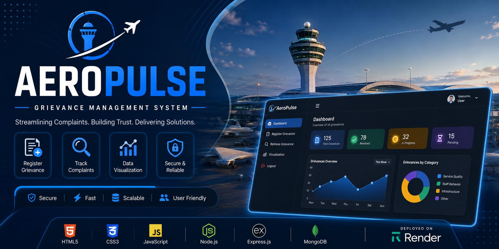

# Hi 👋, I'm Ashish Gupta

### Computer Science Engineering Student • Full-Stack Web Developer • Cybersecurity Learner

  

---

# 💫 About Me

I'm a **Third-Year Computer Science Engineering student** at **Poornima Institute of Engineering & Technology (PIET), Jaipur**, passionate about building scalable, real-world software solutions.

I enjoy transforming ideas into production-ready applications through clean architecture, responsive interfaces, and efficient backend systems.

Recently, I built **AeroPulse Grievance Management System**, a complete full-stack web application using **Node.js, Express.js, MongoDB, HTML, CSS, and JavaScript**, strengthening my understanding of backend development, REST APIs, database integration, deployment, and project architecture.

Apart from full-stack development, I continuously improve my **Data Structures & Algorithms**, explore **Cybersecurity**, and enjoy learning modern software engineering practices.

---

# 🚀 Current Focus

- 🌐 Building Full-Stack Applications using **Node.js**, **Express.js**, **MongoDB** & **Supabase**
- 🔐 Learning Backend Architecture & REST API Design
- 💻 Solving Data Structures & Algorithms
- 🐧 Exploring Linux & Cybersecurity
- 🚀 Building production-ready software projects

---

# 🚀 Featured Projects

<table>

<tr>

<td width="50%" valign="top">

<h2 align="center">🚀 AeroPulse Grievance Management System</h2>

A production-ready <b>Full-Stack Grievance Management System</b> developed using <b>HTML, CSS, JavaScript, Node.js, Express.js, and MongoDB</b>. The platform enables users to register, retrieve, and visualize grievances through a secure and responsive web interface powered by REST APIs.

</td>
<td width="50%" valign="top">

<h2 align="center">✈️ ATC Skill & Proficiency Assessment Performa</h2>

A comprehensive <b>Air Traffic Control (ATC)</b> skill assessment platform designed to digitize proficiency checks, trainee records, attendance tracking, and performance evaluation. The system simplifies training management through an intuitive, responsive, and paperless workflow.

</td>

</tr>

<tr>

<td width="50%" valign="top">

<h2 align="center">🏠 NFT-Based Virtual Real Estate</h2>

A decentralized <b>NFT-based Virtual Real Estate</b> application built on the <b>Stellar Soroban</b> blockchain. The platform enables users to mint, own, manage, and securely trade digital land assets through smart contracts.

</td>

<td width="50%" valign="top">

<h2 align="center">🗳️ Web-Based Voter Registration System</h2>

A responsive voter registration platform inspired by the Election Commission portal, providing an intuitive interface for voter registration, verification, and information management while focusing on accessibility and user experience.

</td>

</tr>

</table>

---
# 💻 Tech Stack

### Languages

### Frontend

### Backend

### Database

### Tools & Platforms

---

# 📊 GitHub Statistics

 

---

# 📈 GitHub Activity

---

# 🌐 Let's Connect

I'm always open to collaborating on exciting projects, contributing to open source, and connecting with developers from around the world.

 

---

## 💭 Quote

> *"Great software is built through consistency, curiosity, and continuous learning — one commit at a time."*

---

### ⭐ Thanks for visiting my profile!

If you enjoy my projects, consider giving a ⭐ to the repositories that you find useful.

