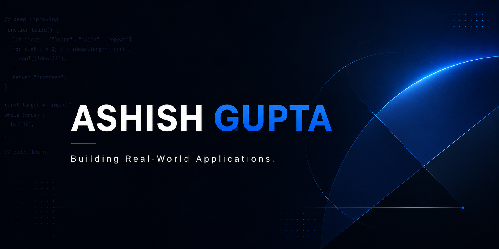
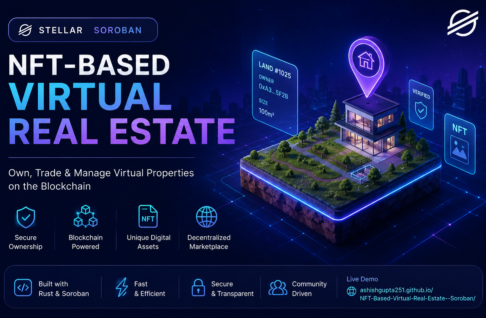
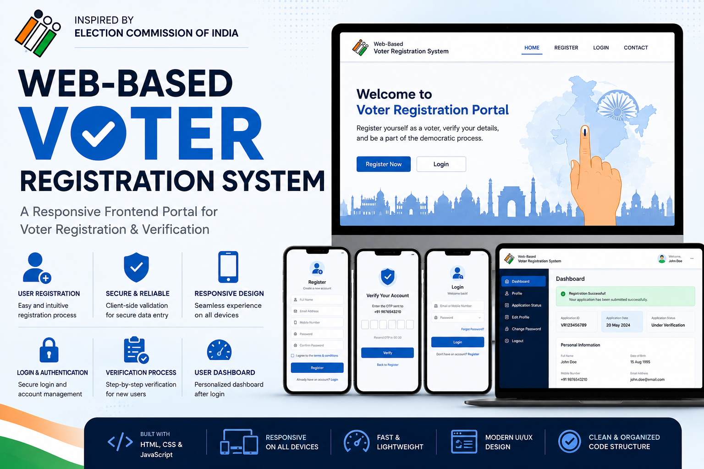

# Hi 👋, I'm Ashish Gupta

### Computer Science Engineering Student • Web Developer • Cybersecurity Learner

  

---

## 💫 About Me

I'm a **Third-Year Computer Science Engineering student** at **PIET, Jaipur**, passionate about building software that solves real-world problems.

From developing an **ATC Skill & Proficiency Management System** to creating responsive web applications, I enjoy turning ideas into practical solutions while continuously learning new technologies.

Outside of development, I regularly practice **Data Structures & Algorithms**, explore **Cybersecurity**, and improve my development workflow through hands-on projects.

---

## 🌱 ## 🚀 What I'm Exploring

- 🌐 Backend Development (Node.js, Express.js & MongoDB)
- 🔐 Cybersecurity & Linux
- 💻 Data Structures & Algorithms
- ⚡ Building scalable web applications

---

# 🚀 Featured Projects

<table>

<tr>

<td width="50%" valign="top">

<h2 align="center">✈️ ATC Skill & Proficiency Assessment Performa</h2>

A web-based platform developed to digitize <b>Air Traffic Control</b> skill assessments, proficiency checks, trainee records and performance tracking through an intuitive and responsive interface.

</td>

<td width="50%" valign="top">

<h2 align="center">🪙 NFT-Based Virtual Real Estate</h2>

A decentralized <b>NFT-based Virtual Real Estate</b> smart contract built on the <b>Stellar Soroban</b> platform, enabling users to mint, manage and trade digital properties securely on the blockchain.

</td>

</tr>

<tr>

<td colspan="2">

<h2 align="center">🗳️ Web-Based Voter Registration System</h2>

A responsive voter registration platform inspired by the Election Commission portal, providing a clean interface for registration, verification and user-friendly navigation.

</td>

</tr>

</table>

---
---

# 💻 Tech Stack

### Languages

### Frontend

### Backend (Currently Learning)

### Database (Currently Learning)

### Tools & Platforms

---

# 📊 GitHub Statistics

 

---

# 📈 GitHub Activity

---
---

# 🌐 Let's Connect

I'm always open to connecting with developers, collaborating on interesting projects, and learning from the tech community.

 

---

## 💭 Quote

> *"Success isn't built in a day — it's built one commit, one bug fix, and one lesson at a time."*

---

### ⭐ Thanks for visiting my profile!

If you like my work, consider giving a ⭐ to my repositories.

